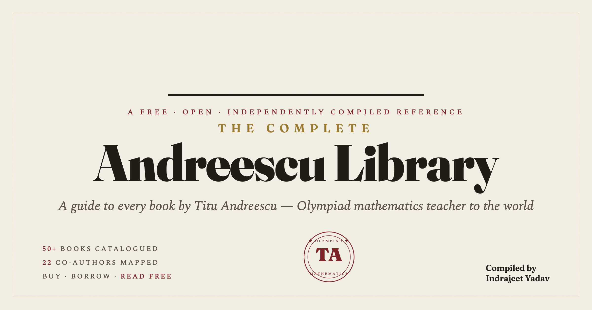

# The Complete Andreescu Library



**A free, beautifully organised guide to the life, achievements, and every book of [Titu Andreescu](https://en.wikipedia.org/wiki/Titu_Andreescu) — the Olympiad mathematics teacher who has trained, and written for, the world.**

> Many talented students — and even teachers — have never heard his name. This project exists to change that: one place where any curious student, anywhere, can discover his work, understand why it matters, and find a **legitimate** way to read it.

🔗 **Live site:** _enable GitHub Pages → it will appear at_ `https://yosoyun.github.io/andreescu-library/`
📄 **PDF edition:** [`pdf/The-Andreescu-Library.pdf`](pdf/The-Andreescu-Library.pdf)

---

## What's inside

- **Biography & timeline** — from a prize-winning schoolboy in Timișoara to UT Dallas, the AMC, and the 1994 perfect-score IMO team.
- **What he built** — AwesomeMath, the free *Mathematical Reflections* journal, XYZ Press, the USA IMO program, the Metroplex Math Circle.
- **The complete catalogue** — 50+ books and collected volumes, fully **searchable and filterable** by topic, level, publisher and co-author.
- **A co-author map** — the 20+ mathematicians he wrote these books with.
- **Legitimate access for every book** — live links to buy in India (Amazon.in, Flipkart), borrow legally (Internet Archive), preview free (Google Books), publisher pages, and genuinely free material.
- **A "read for free" section** — starting with the *Mathematical Reflections* journal, which is 100% free online.

## Design

A single self-contained `index.html` (no build step, no dependencies, works offline). Archival/editorial aesthetic — **Fraunces** + **Spectral** typefaces, parchment & ink palette, paper-grain texture, and a "midnight study" dark mode. Fully responsive.

## Repository layout

```
index.html                     The website (self-contained — just open it)
data/books.json                The catalogue data (facts only — reusable)
pdf/The-Andreescu-Library.pdf  Print/share edition (cover + clickable TOC)
pdf/the-andreescu-library.md   Markdown source for the PDF
```

## How it was built

The bibliography was compiled from public sources (Wikipedia, Art of Problem Solving, AwesomeMath / XYZ Press, Springer & Birkhäuser, Goodreads, the AMS & MAA bookstores). The website renders the catalogue from `data/books.json`; the PDF is generated from the same data so the two never drift.

## ⚖️ Important — no files are hosted here

This is an **independent, non-commercial educational reference**. It is **not** affiliated with or endorsed by Titu Andreescu, AwesomeMath, XYZ Press, Springer/Birkhäuser, the MAA, or any retailer.

Every book listed is **copyrighted** by its authors and publishers. This project hosts **no PDFs** and links to **no pirated copies**. The buy / borrow / preview buttons are live search links to legitimate retailers, legal library lending, free previews, and genuinely free material. **Please support the authors by buying or borrowing through legitimate channels.**

Bibliographic details may contain small errors (several titles have multiple editions); corrections via issues/PRs are welcome.

## Credits

Compiled with care by **Indrajeet Yadav** ([@Yosoyun](https://github.com/Yosoyun)) to help students and teachers everywhere discover these books. Free to share.

*Content & code released for free educational use. Attribution appreciated.*
